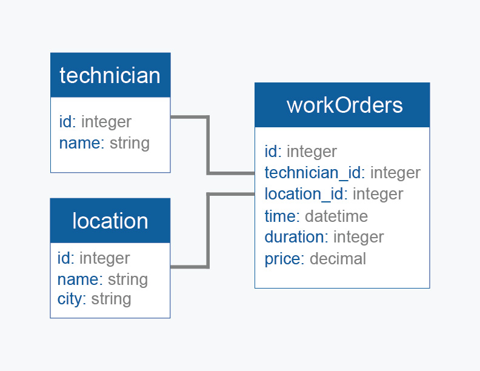

## Lloyd_Pest_Control
##### By: Gluay S. Wang

### Please run bin/webpack-dev-server after rails s

### Deploy Heroku
https://lloyd-pest-control.herokuapp.com/

(I've run these commands twice)
- bundle lock --add-platform x86_64-linux
- bundle lock --add-platform ruby
- git status
- git add .
- git commit -m "add ruby and linux to Gemfile"
- git push origin main

- rails db:system:change --to=postgresql
- bundle


### set up the project
- rails new lloyd_pest_control -d postgresql -T
- cd lloyd_pest_control folder
- rails db:create
- create a github repo (lloyd-pest-control)
- git init (in Terminal)
- git add .
- git commit -m "first commit"
- git remote add origin https://github.com/Gluay88/lloyd-pest-control.git
- git push -u origin main



### Create an Invoice model
- rails g scaffold Invoice date:datetime client:string tax:decimal saleperson:string
- rails db:migrate
- added the invoice data 
- config/routes.rb - add root to: 'invoices#index'
- rails g controller welcome index technicians locations orders 
- app/views/layouts/application.html.erb -- added link_to 
``` ruby
<body>
    <%= link_to "Home", root_path %>
    <%= link_to "Technicians", welcome_technicians_path %>
    <%= link_to "Locations", welcome_locations_path %>
    <%= link_to "Work Orders", welcome_orders_path %>
    <%= link_to "Invoices", invoices_path %>
    <%= link_to "Login", root_path %>
    <%= yield %>
</body>
```
### Add Bootstrap
Gemfile
gem 'bootstrap-sass', '~> 3.4.1'
gem 'sassc-rails', '>= 2.1.0'

bundle install (in Terminal)
rename stylesheet css
yarn add bootstrap
mv app/assets/stylesheets/application.css app/assets/stylesheets/application.scss

### Create Technician Model
- rails g scaffold Technician name:string --no-stylesheets
- rails db:migrate

### Please don't do this..
rails g migration add_id_to_technician id:interger
rails db:migrate
### How to fix it..
rails destroy migration add_id_to_technician

### CSV Upload
app/views/technicians/index.html.erb
add
``` ruby
<h4>Import Technicians</h4>
<%= form_tag import_technicians_path, multipart: true do %>
  <%= file_field_tag :file %>
  <%= submit_tag "Upload File" %>
<% end %>
```
config/routes.rb
add
``` ruby
resources :technicians do 
    collection { post :import }
end
```

app/controllers/technicians_controller.rb
add
``` ruby
def import 
    Technician.import(params[:file])
    redirect_to technicians_path, notice: "Technicians Added Successfully!"
end
```
app/models/technician.rb
add
``` ruby
def self.import(file)
    CSV.foreach(file.path, headers: true) do |row| 
        self.find_or_create_by(id: row["id"]) do |technician|
        technician.name = row["name"]
        end  
    end
end
```
config/application.rb 
add
```ruby 
    require "csv"
```
### Create Location Model
- rails g scaffold Location name:string city:string --no-stylesheets
- rails db:migrate
- Repeat the process from Technical Model

app/models/location.rb
add
``` ruby 
def self.import(file)
    CSV.foreach(file.path, headers: true) do |row| 
        self.find_or_create_by(id: row["id"]) do |location|
        location.name = row["name"]
        location.city = row["name"]
        end  
    end
end
```

## Drop database 
- rails db:reset

### Create WorkOrder Model
- rails g scaffold WorkOrder technician:references location:references time:datetime duration:integer price:decimal
- rails db:migrate

app/models/work_order.rb
add
``` ruby
def self.import(file)
    CSV.foreach(file.path, headers: true) do |row| 
        self.find_or_create_by(id: row["id"]) do |workorder|
        workorder.technician_id = row["technician_id"]
        workorder.location_id = row["location_id"]
        workorder.time = row["time"]
        workorder.duration = row["duration"]
        workorder.price = row["price"]
        end  
    end
end
```
app/models/technician.rb
add 
``` ruby
has_many :workorders
has_many :locations, through: :workorders
```
app/models/location.rb
add
``` ruby
has_many :workorders
has_many :technicians, :through => :workorders
```
- Romoved Log in link (I don't need it yet for this project)

### Download CSV from database
app/controllers/work_orders_controller.rb
add

``` ruby
respond_to do |format|
    format.html
    format.csv { send_data @work_orders.to_csv }
end
```
app/models/work_order.rb
add
``` ruby
def self.to_csv
    attributes = %w{id technician_id location_id time duration price}
    CSV.generate(headers: true) do |csv|
      csv << attributes
      all.each do |workorder| 
        csv << workorder.attributes.values_at(*attributes)
      end
    end
end
```
app/views/work_orders/index.html.erb
add

``` ruby
<div class="download-container">
  <h4>Download Work_Orders</h4>
  <button>
    <%= link_to "Download File", work_orders_path(format: "csv") %>
  </button>
</div>
```

### Work Order Database
